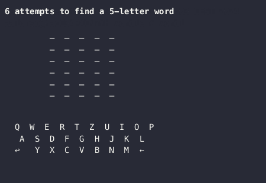

# Terminal Wordle
  

Play the NYT daily Wordle from the comfort of your terminal!



⚠️ this assumes you know how to use the terminal! If you don't you can find out how [here](https://www.google.com/search?q=how+to+use+the+terminal).

## Install
For ARM (Apple Sillicon) you can run in the terminal

```bash
curl -sSL https://raw.githubusercontent.com/Alvaroalonsobabbel/wordle/main/bin/install.sh | bash
```

You'll required to enter your admin password.
You might be required to enable the program to run in the System Settings.

### Building the binary yourself

1. [Install Go](https://go.dev/doc/install)
2. Clone the repo `git clone git@github.com:Alvaroalonsobabbel/wordle.git`
3. CD into the repo `cd wordle`
4. Download dependencies using `go mod download`
5. Build the binary `make build`

## How to Play

You can check the official Wordle rules [here](https://www.nytimes.com/2023/08/01/crosswords/how-to-talk-about-wordle.html).

Run wordle by running `wordle` in your Terminal.
Have fun playing Wordle.
You can quit the game at any time by pressing `Esc` or `Ctrl C`

## Options

Hard Mode
`wordle -hard`
